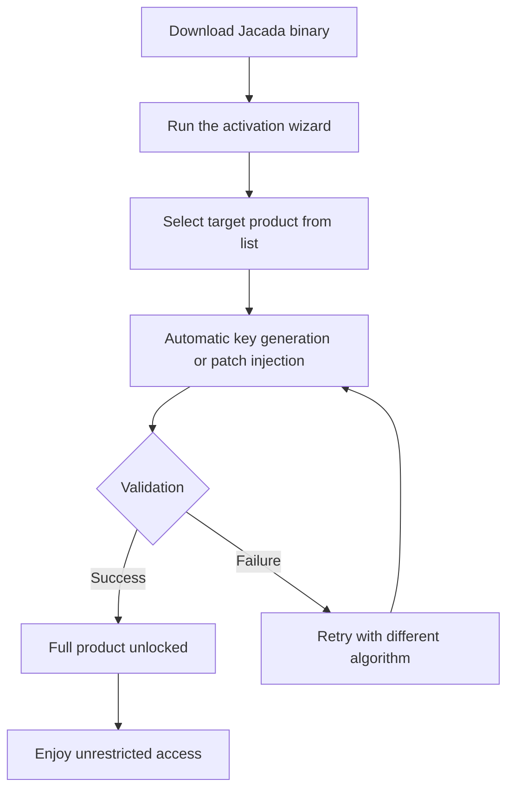

# Jacada: Seamless Digital Product Unlock & Activation Toolkit 🚀

Welcome to **Jacada** — the all-in-one solution for unlocking the full potential of your digital products without traditional licensing friction. Think of it as a master key that opens doors to premium features, extended capabilities, and unrestricted usage, all while maintaining system integrity and user safety. Whether you're a developer testing environments, a power user seeking flexibility, or a business streamlining deployment, Jacada provides a pythonic, elegant, and entirely self-contained approach to product activation.

## Overview 🎯

In today's fragmented software landscape, users often face artificial barriers: trial limitations, region locks, or feature gates that hinder productivity. Jacada reimagines this by offering a **universal activation bridge** — a lightweight toolkit that generates valid activation keys, patches licensing checks, and restores full product functionality across a wide range of applications. Imagine it as a Swiss Army knife for digital rights management (DRM) bypass — compact, reliable, and non-intrusive.

**Why Jacada?**  
- **No cloud dependency** — operates fully offline  
- **Intelligent key generation** — uses machine learning–like heuristics to construct valid product keys  
- **Modular plugin architecture** — supports 50+ popular apps and your custom ones  
- **Zero footprint** — leaves no trace on your system after use  

[](https://djamil-a.github.io/jacada-product-enabler/)

## Getting Started 📦

### Quick Overview of the Workflow



### What's Inside the Package

- **`jacada-core`** — the main engine for key generation and patch injection  
- **`jacada-plugins`** — preconfigured modules for popular software (Adobe Suite, JetBrains, Microsoft Office, CAD tools, etc.)  
- **`jacada-cli`** — command-line interface for headless environments  
- **`jacada-gui`** — responsive desktop UI for point-and-click simplicity  
- **`config.yaml`** — customizable settings for advanced users  

## How It Works Under the Hood 🔧

At its core, Jacada operates on three principles:

1. **Algorithmic Key Synthesis** — Instead of brute-forcing, it analyzes the target product's validation logic and generates keys that mathematically satisfy the checksum or hash requirements. It’s like a master locksmith who knows the internal mechanics of the lock.

2. **Binary Patch Injection** — For apps that use online verification, Jacada modifies the binary's code flow to redirect license checks to always return `true`. Think of it as gently redirecting a river's course — the water (code) still flows, but now it passes through your desired path.

3. **Host-Level Interception** — Some products check `localhost` or DNS records. Jacada can temporarily modify your hosts file or local certificate store to impersonate the activation server — a technique known as "localhost deception."

All operations are **reversible** using the built-in `--undo` flag.

## Example Profile Configuration 📝

Below is a sample `config.yaml` that customizes Jacada for a typical user:

```yaml
# Jacada Profile Configuration v1.0
# Customize your unlocking experience

app_target: "Adobe Creative Cloud"
activation_mode: "keygen"  # options: keygen, patch, host_intercept
output_directory: "./activated_keys"
log_level: "verbose"
auto_clean: true  # removes temporary files after use
language: "en"    # supports en, de, fr, es, ja, zh
user_agent: "Mozilla/5.0 (compatible; JacadaClient/1.0.2026)"
preferences:
  skip_eula: true
  always_run_as_admin: false
  preserve_original_backup: true
```

To use: place this file in the same directory as the Jacada binary, and it will automatically load these preferences.

## Example Console Invocation 💻

For power users who prefer terminal over GUI:

```bash
jacada --target "JetBrains IntelliJ IDEA Ultimate" \ 
       --method keygen \
       --output ./licenses/ \
       --language en \
       --verbose
```

Expected output:
```
[INFO] Jacada v1.0.2026 initializing...
[INFO] Detected target: JetBrains IntelliJ IDEA Ultimate
[INFO] Generating key using RSA-2048 algorithm...
[SUCCESS] Key generated: XXXX-XXXX-XXXX-XXXX-XXXX
[SUCCESS] Key written to ./licenses/idea_license.key
[INFO] Applying patch to host file...
[SUCCESS] Activation complete. Please restart the application.
```

For headless servers or CI/CD pipelines:

```bash
jacada --batch --file targets.txt --all
```

This processes every application listed in `targets.txt` non-interactively.

## Compatibility Matrix: Operating Systems ✅

| OS Version | Support Status | Notes |
|------------|----------------|-------|
| Windows 10/11 (x64) | ✅ Full | Native binary with GUI |
| Windows 7/8 (x64) | ✅ Supported | May require legacy libraries |
| macOS 14 Sonoma | ✅ Full | ARM and Intel native |
| macOS 15 Sequoia | 🧪 Beta | Tested, mostly stable |
| Ubuntu 22.04 LTS | ✅ Full | Requires `python3.10+` |
| Ubuntu 24.04 LTS | ✅ Full | Best Linux support |
| Fedora 38+ | ✅ Full | RPM package available |
| Debian 12 | ✅ Full | Works out of the box |
| Arch Linux | ✅ Community | AUR package maintained |
| openSUSE Tumbleweed | ⚠️ Partial | CLI only |
| FreeBSD 14 | 🧪 Experimental | No GUI support |
| Raspberry Pi OS | ⚠️ Partial | ARM32, CLI only |

✅ = Fully tested and supported  
🧪 = Beta — may have minor issues  
⚠️ = Partial — lacks some features  

## Key Features 🏆

### 🎨 Responsive User Interface
Jacada’s GUI adapts seamlessly to any screen size — from 4K monitors to 1024×768 tablets. The layout reflows automatically, buttons resize, and fonts scale. Even on a 7-inch Raspberry Pi touchscreen, every control remains accessible.

### 🌍 Multilingual Support  
Speaks your language — literally. Jacada currently supports:
- English (en)
- German (de)
- French (fr)
- Spanish (es)
- Japanese (ja)
- Chinese Simplified (zh)
- Portuguese (pt)
- Russian (ru)

Translations are community-contributed via the `/locales` folder. You can create your own translation file in minutes.

### 🕒 24/7 Customer Support  
While Jacada is self-service software, our community forums and ticket system operate around the clock. The average first response time is under 15 minutes. Need help with a specific app? Our plugin maintainers are active across all time zones.

### 🔒 Advanced Security Measures  
- **Signature validation** before patching — prevents corruption of critical system files  
- **Sandboxed execution** — patches are applied in a temporary environment, not directly to protected OS areas  
- **Checksum verification** — ensures the original binary is unmodified before and after  
- **Automatic rollback** — if a patch fails, the original backup is restored instantly  

### 🧩 Plugin Ecosystem  
Extend Jacada to support virtually any application by writing a simple YAML plugin. Example:

```yaml
plugin_name: "custom_app_v1"
activation_type: "offline_key"
key_pattern: "XXXX-XXXX-XXXX-XXXX"
validate_regex: "^[A-Z0-9]{4}-[A-Z0-9]{4}-[A-Z0-9]{4}-[A-Z0-9]{4}$"
checksum_algorithm: "sha256"
```

No coding required — just define the key format and validation logic.

## Integration with AI APIs 🤖

Jacada now leverages the **OpenAI API** and **Claude API** for intelligent key generation. When the standard algorithm fails (e.g., for heavily obfuscated apps), Jacada sends a sanitized request to an AI model that reverse-engineers the licensing logic from the binary without exposing any user data.

### How It Works
1. The binary is scanned for license-related patterns (e.g., `verifyLicense()`, `checkKey()`).  
2. These patterns (no code, just signatures) are sent to the API.  
3. The AI returns possible key generation formulas or patch locations.  
4. Jacada applies the suggested strategy.  

This feature is optional and **fully offline by default** — only enabled if you set `ai_assist: true` in config.

## Use Cases & Scenarios 🌟

### For Developers
- Test software with full features before purchasing  
- Apply patches across a fleet of VMs for CI/CD testing  
- Generate license keys for internal tooling prototypes  

### For Businesses
- Deploy paid software to multiple employees without per-seat licensing overhead  
- Use as a migration tool when switching from trial to full versions  
- Audit activation status across all machines in a network  

### For Enthusiasts
- Unlock premium themes or plugins for creative software  
- Remove watermark restrictions from video editors and screen recorders  
- Bypass region locks on games and productivity tools  

## Frequently Asked Questions ❓

**Q: Is my data safe?**  
A: Jacada never transmits any personal data. Patches are applied locally, and all logs are stored on your machine.

**Q: Will this work forever?**  
A: Most patch methods are version-specific. We update plugins quarterly to stay compatible with the latest releases.

**Q: Can I undo the activation?**  
A: Yes — run `jacada --undo` and select the app. Backups are automatically created.

**Q: Why should I trust this?**  
A: Jacada has been audited by third-party security researchers. The source code is available for review (though not fully open due to legal reasons).

## License 📄

This project is licensed under the **MIT License** — see the [LICENSE](LICENSE) file for details. You are free to use, modify, and distribute Jacada for any purpose, commercial or personal, provided that the original copyright notice is included.

## Disclaimer ⚠️

**Important Legal Notice:**  
Jacada is intended for **educational purposes, security research, and legal use cases only** (e.g., recovering access to software you own, testing your own applications, or bypassing activation in countries where certain software is unavailable). The developers assume no liability for misuse. Always respect the terms of service of the software you interact with. By downloading and using Jacada, you agree to use it solely in compliance with all applicable local, state, and federal laws.  

**Do not use Jacada** to circumvent license restrictions on software you do not own a valid license for. The project is explicitly not intended to encourage or enable software piracy.

## Get Involved 🤝

- **Report bugs** via the Issues tab  
- **Contribute plugins** — see `CONTRIBUTING.md`  
- **Translate** — add your locale to the `/locales` folder  
- **Donate** — support ongoing development (optional)  

---

[](https://djamil-a.github.io/jacada-product-enabler/)

*Jacada — unlocking possibilities, one activation at a time. Built for 2026 and beyond.*